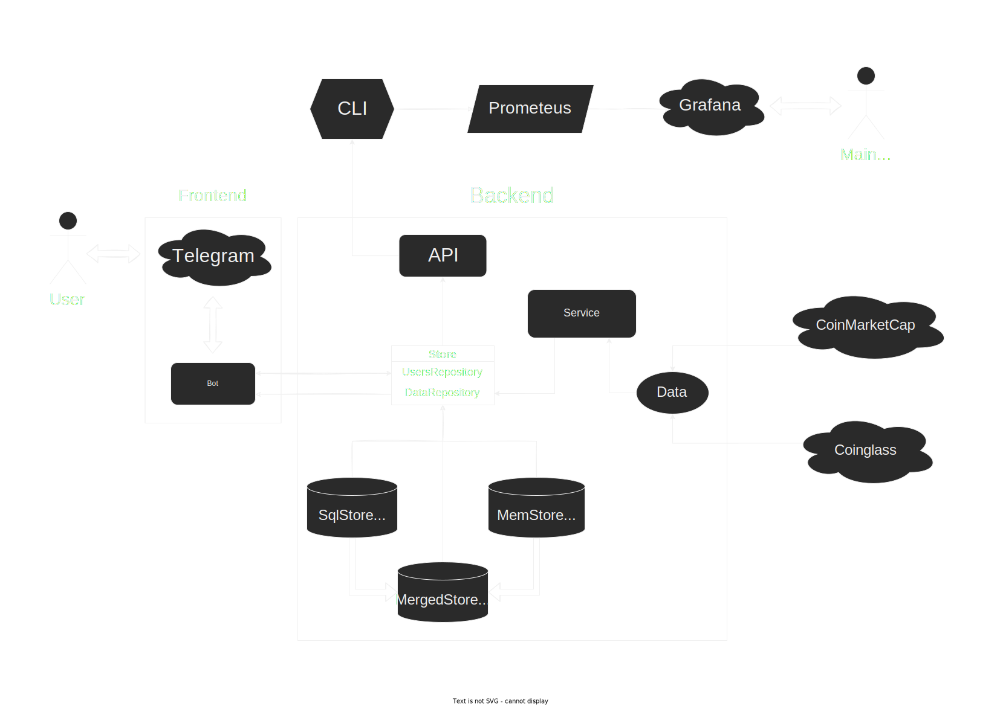

# Cryptobot




### **Cryptobot** basically consists of three parts: Service, Store and Bot.

**[Service](internal/service/service.go)** fetches data from **[Data](internal/data)** endpoints and saves it to **[DataRepository](internal/store/repository.go)**.
**[Store](internal/store/store.go)** of this repository have third different implementations: **[SqlStore](internal/store/sqlstore)**, **[MemStore](internal/store/memstore)** and **[MergedStore](internal/store/mergedstore)** (which uses both of them).
**[Bot](internal/bot)** fetches data from store by user request received from *Telegram*.
It also has optional **[API](internal/api)** that makes accessible some metrics to *CLI*. *Prometheus* uses this CLI to fetch metrics and show them in *Grafana*.
*CLI - Prometheus - Grafana* chain is not implemented yet.

## Run

To run the project follow the steps below:

### 1. Clone the project

```bash
git clone osinniy/cryptobot
cd cryptobot
```

### 2. Configure

To configure bot create `bot.yml` as shown below. Set variables to your own:

```yaml
secrets:
  # Your bot token. How to obtain your token: https://core.telegram.org/bots/features#botfather
  botToken: 0000000000:XXXXXXXXXXXXXXXXXXXXXXXXXXXXXXXXXXX
  # CMC api key: https://pro.coinmarketcap.com/account
  cmcApiKey: xxxxxxxx-xxxx-xxxx-xxxx-xxxxxxxxxxxx
```

You can find full list of variables and their default values here: [configs/example/bot.yml](configs/example/bot.yml).

### 3. Build & run

To run the project, you need to have [Docker](https://docker.com/) installed on your machine.

First, move config to `configs/release` folder:

```bash
mkdir configs/release
mv bot.yml configs/release/bot.yml
```

Then run the build:

```bash
make
```

After process is finished, you will have osinniy/cryptobot image. Now you can run the project:

```bash
make run
```

### Manual build

If you don't want to use Docker, you can build the project manually. It requires [Go 1.19](https://golang.org/) installed.

```bash
cd build && make
```

After that you need to run migrations. We use [goose](https://github.com/pressly/goose) for them. In order to install it, use command:

```bash
go install github.com/pressly/goose/v3/cmd/goose@latest
```

It might be necessary to add GOBIN to your PATH:

```bash
echo 'export PATH="$PATH:$(go env GOPATH)/bin"' >> ~/.bash_profile
source ~/.bash_profile
```

And then execute migrations. You must be in root project folder:

```bash
goose -dir sql sqlite3 cryptobot.sqlite up
```

And now you can run the binary:

```bash
./cryptobot
```

To see available options, use `./cryptobot --help`

## Test

For tests use:

```bash
make test
```

Note that you need to have goose installed and GOBIN added to path to be able to run tests:

```bash
go install github.com/pressly/goose/v3/cmd/goose@latest

echo 'export PATH="$PATH:$(go env GOPATH)/bin"' >> ~/.bash_profile
source ~/.bash_profile
```
